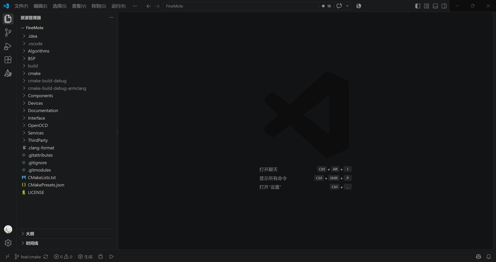
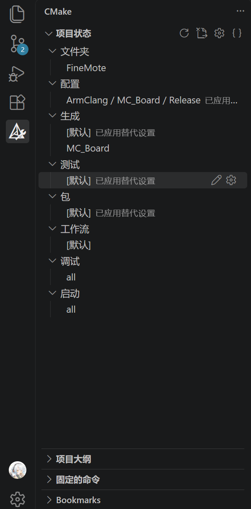

# 快速上手 *FineMote*

## *FineMote* 是什么？
FineMote 是一套针对机器人应用的嵌入式代码框架，通过抽象层设计和内置的调度器，为嵌入式开发者提供高效、易用的开发环境。  
本教程从源码获取与编译开始，基于真实开发场景，手把手指导如何快速上手 FineMote，并在机器人应用中实现具体功能。

## 获取并构建 *FineMote*

本章从源码获取与开发环境配置开始，完成完整的构建与烧写流程。

### 获取源码

FineMote 当前通过[GitHub](https://github.com/FINS-Fines/FineMote)分发，可以使用 vscode 自带的存储库功能克隆 https://github.com/FINS-Fines/FineMote.git ，或者在命令行中使用以下指令获取源码：

```console
git clone --recurse-submodules https://github.com/FINS-Fines/FineMote.git
```
```text
Cloning into 'FineMote'...
remote: Enumerating objects: 9808, done.
remote: Counting objects: 100% (477/477), done.
remote: Compressing objects: 100% (258/258), done.
remote: Total 9808 (delta 315), reused 338 (delta 218), pack-reused 9331 (from 3)
Receiving objects: 100% (9808/9808), 18.01 MiB | 2.28 MiB/s, done.
Resolving deltas: 100% (5667/5667), done.
Updating files: 100% (3875/3875), done.
```

完成后，使用 vscode 打开仓库目录（右键 -> 通过Code打开），出现以下界面即为完成：

<p align= "center">
  
</p>

### 配置编译环境

FineMote 支持多种工具链，本文以 Windows 平台为例，推荐使用 ArmClang 编译器进行编译。

#### 省流版

1. 下载并安装[CMake 4.4.2](https://github.com/Kitware/CMake/releases/download/v4.4.2/cmake-4.4.2-windows-x86_64.msi)，勾选 *Add CMake to the system PATH for all users*。  
2. 下载并解压[Ninja 1.13.2](https://github.com/ninja-build/ninja/releases/download/v1.13.2/ninja-win.zip)。  
3. 获取 ARM 编译工具链：  
    - 通过 Keil 获取 ArmClang 编译器
    - 或者，下载并安装[arm-gnu-toolchain-15.3.rel1](https://gitlab.arm.com/api/v4/projects/tooling%2Fgnu-toolchains-for-arm/packages/generic/gnu-toolchain/15.3.rel1/arm-gnu-toolchain-15.3.rel1-mingw-w64-x86_64-arm-none-eabi.msi)。  
4. 为 Ninja 和 ArmClang （或 arm-none-eabi-gcc） 添加环境变量。  
5. 在 vscode 中安装[CMake Tools扩展](https://marketplace.visualstudio.com/items?itemName=ms-vscode.cmake-tools)。  
6. 快速校验环境：  
    ```console
    cmake --version
    ninja --version
    armclang --version
    arm-none-eabi-gcc --version
    ```

#### 安装 CMake

FineMote 使用 CMake 作为构建系统生成工具，并依此实现板卡选择。  
可以在[CMake下载页](https://cmake.org/download/)获取 CMake，选择对应的操作系统版本下载并安装，安装过程中建议勾选 *Add CMake to the system PATH for all users*，以便在命令行中直接使用 CMake。  
FineMote 建议使用 CMake 3.24 或更高版本，本文所用环境是[CMake 4.4.2](https://github.com/Kitware/CMake/releases/download/v4.4.2/cmake-4.4.2-windows-x86_64.msi)。  
完成安装后，使用命令行运行以下命令，验证 CMake 是否安装成功：

```console
cmake --version
```
```text
cmake version 4.4.2

CMake suite maintained and supported by Kitware (kitware.com/cmake).
```

记得为 vscode 安装[CMake Tools扩展](https://marketplace.visualstudio.com/items?itemName=ms-vscode.cmake-tools)。

#### 安装 Ninja

Ninja 是一个小巧的构建系统，FineMote 使用 Ninja 作为默认构建工具。  
可以在[Ninja发布页](https://github.com/ninja-build/ninja/releases)获取 Ninja，选择对应的操作系统版本，下载后将其解压到任意目录（建议使用简单的纯英文目录，如 `D:\ninja`），记得将 Ninja 的路径添加到环境变量中。  
本文所用环境是[Ninja 1.13.2](https://github.com/ninja-build/ninja/releases/download/v1.13.2/ninja-win.zip)。  
完成安装后，使用命令行运行以下命令，验证 Ninja 是否安装成功：

```console
ninja --version
```
```text
1.13.2
```

#### 获取 ArmClang 编译器

我们推荐使用 ArmClang 编译器进行编译，ArmClang 是 Arm Compiler for Embedded 工具链中的 C/C++ 编译器。
获取*可以使用的* ArmClang 编译器，最简单的方式是随 Keil 一同获得（如何获得 Keil 的许可建议自行搜索）。  
在 Keil 安装目录下，ArmClang 编译器的路径一般为 `\Keil_v5\ARM\ARMCLANG\bin\armclang.exe`，将其添加到环境变量中。

#### 获取 arm-none-eabi-gcc 编译器

若在获取 ArmClang 编译器时遇到困难，也可以使用 Arm GNU 工具链进行编译。  
arm-none-eabi-gcc 是 Arm GNU Toolchain 中的 GCC 交叉编译器，是开源免费的。  
可以在[Arm GNU发布页](https://gitlab.arm.com/tooling/gnu-toolchains-for-arm)获取 arm-none-eabi-gcc，选择对应的操作系统版本下载并安装，记得将 arm-none-eabi-gcc 的路径添加到环境变量中，一般为安装目录下的 `bin` 文件夹。  
本文所用环境是[arm-gnu-toolchain-15.3.rel1](https://gitlab.arm.com/api/v4/projects/tooling%2Fgnu-toolchains-for-arm/packages/generic/gnu-toolchain/15.3.rel1/arm-gnu-toolchain-15.3.rel1-mingw-w64-x86_64-arm-none-eabi.msi)。  
完成安装后，使用命令行运行以下命令，验证 arm-none-eabi-gcc 是否安装成功：

```console
arm-none-eabi-gcc --version
```
```text
arm-none-eabi-gcc (Arm GNU Toolchain 15.3.Rel1 (Build arm-15.149)) 15.3.1 20260627
Copyright (C) 2025 Free Software Foundation, Inc.
This is free software; see the source for copying conditions.  There is NO
warranty; not even for MERCHANTABILITY or FITNESS FOR A PARTICULAR PURPOSE.
```

### 编译 *FineMote*

使用 CMake 构建 FineMote，可以选择在命令行中使用 CMake，也可以在 IDE 中使用 CMake 插件进行构建。

#### 关于工具链与板卡选择

FineMote 使用 CMake Presets 统一管理工具链、板卡和构建类型等配置，不同的 configurePresets 对应一组完整的 CMake 配置参数，其格式形如 `toolchain-board-buildtype` ，名称则是 `ToolChain / Board / BuildType`，例如配置 `armclang-MC_Board-debug` 的名称是 `ArmClang / MC_Board / Debug`，表示使用 ArmClang 工具链，为 MC_Board 生成 Debug 构建配置。

各板卡对应的板卡支持包 BSP 已经由 preset 完成选择，无需手动指定。

#### 通过 IDE 构建

以 VSCode 为例，在安装 CMake Tools扩展后打开有效的 CMake 项目目录，扩展识别后在左侧功能栏会出现 CMake 图标，点击后会显示 CMake 工具栏。

<p align= "center">
  
</p>

在工作栏中，选择所需的构建配置，比如 `ArmClang / MC_Board / Debug`，可保持其余选项不变，点击状态栏中的 ⚙生成 按钮，扩展会自行调用 CMake 命令行工具完成构建，看到以下输出即为构建成功：

```text
[driver] 生成完毕: 00:00:00.266
[build] 生成已完成，退出代码为 0
```

#### 使用命令行构建

在命令行中进入 FineMote 项目目录，使用 CMake 命令行工具的 `--preset` 参数指定预设进行配置，例如：

```console
cmake --preset armclang-MC_Board-debug
```
```text
-- Configured for armclang toolchain targeting MC_Board
-- finemote_core initialized with modules: Algorithms;Components;Devices;Interface;Services
-- etl | Version string determined with git describe: 20.47.1
-- etl | Determined ETL version 20.47.1 from the git tag
-- Configuring done (10.4s)
-- Generating done (0.3s)
-- Build files have been written to: D:/Learn-STM32/FineMote/build/armclang-MC_Board-debug
```

继续使用 `--build` 参数完成构建：

```console
cmake --build .\build\armclang-MC_Board-debug
```
```text
[698/699] Linking CXX executable MC_Board.elf
Program Size: Code=67788 RO-data=10232 RW-data=40 ZI-data=61520  
```

### 烧录与调试

在完成编译后我们获得了扩展名为 `.elf` 的可执行文件，位于 `/build/armclang-MC_Board-debug` 目录下，接下来我们要使用 ST-Link 和烧录工具将其送上开发板，完成运行调试。  
关于 ST-Link 的使用，此处不再赘述。若使用其他编程器，相信你肯定已经会正确配置 OpenOCD。

#### 获取烧录工具 OpenOCD

OpenOCD 是一个开源的片上调试器，支持多种调试接口和处理器架构，常用于 ARM 嵌入式系统的烧录与调试。  
可以在[xPack OpenOCD分发页](https://github.com/xpack-dev-tools/openocd-xpack/releases)获取 OpenOCD，选择对应的操作系统版本，下载后将其解压到任意目录中，并将 `bin` 目录添加至环境变量中。  
本文所用环境是[xpack-openocd-0.12.0-7](https://github.com/xpack-dev-tools/openocd-xpack/releases/download/v0.12.0-7/xpack-openocd-0.12.0-7-win32-x64.zip)。  
完成安装后，使用命令行运行以下命令，验证 OpenOCD 是否安装成功：

```console
openocd -v
```
```text
xPack Open On-Chip Debugger 0.12.0+dev-02228-ge5888bda3-dirty (2025-10-04-22:44)
Licensed under GNU GPL v2
For bug reports, read
        http://openocd.org/doc/doxygen/bugs.html
```

记得为 vscode 安装[Cortex-Debug扩展](https://marketplace.visualstudio.com/items?itemName=marus25.cortex-debug)。

#### 使用 OpenOCD 烧录与调试

OpenOCD 启动 GDB Server，负责与 ST-Link 和目标芯片通信；Cortex-Debug 可以作为 vscode 的调试扩展，调用 GDB 连接 OpenOCD。
在工作区的 `.vscode` 目录下新建 `launch.json` 文件，配置调试参数：

```json
{
    "version": "0.2.0",
    "configurations": [
        
        {
            "name": "Run FineMote With OpenOCD",
            "type": "cortex-debug",
            "request": "launch",
            "servertype": "openocd",
            
            "cwd": "${workspaceFolder}",
            "executable": "${command:cmake.launchTargetPath}",

            "configFiles": [
                "${workspaceFolder}/OpenOCD/stm32f4+st-link.cfg"
            ],

            "runToEntryPoint": "main"
        }
    ]
}
```

这样，在 vscode 中启动调试并选择 `Run FineMote With OpenOCD` 调试器时，将会通过 Cortex-Debug 扩展调用 OpenOCD 命令行工具，启动调试。

### 后记

至此，我们已经完成了完整的构建和调试流程，接下来就可以在 FineMote 的基础上开发业务了。

插一嘴，如果你与笔者一样，第一次接触复杂的工程 C++ 项目，可能会觉得工程 C++ 项目的配置与构建有点复杂。  
~~的确，C++ 的构建流程不说是简洁明了，也只能说是非常复杂。~~  
并且，构建生成工具 CMake 的学习曲线相对陡峭，但掌握 CMake 的使用方法对嵌入式开发又是相对必要的。  
因此，在此推荐阅读笔者的另一篇笔记 [C++ 构建快速指南](../../Learning%20Notes/C%2B%2B%E6%9E%84%E5%BB%BA%E5%BF%AB%E9%80%9F%E6%8C%87%E5%8D%97.md)，快速了解完整构建一个 C++ 工程的流程，掌握基本的 CMake 使用方法。

## 使用 *FineMote* 实现业务逻辑

配置好开发环境之后，我们就可以开始写业务了。  
本章从基础的电机控制开始，逐步介绍 FineMote 的使用方法，并建立基本的结构概念。

### 板卡选择

### 用 *FineMote* 控制电机

